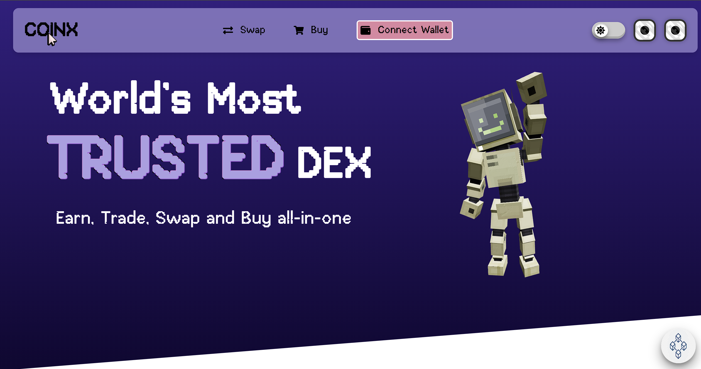
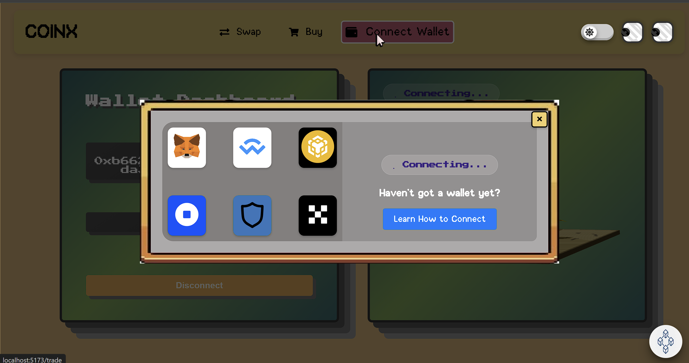

# COINX
A brief description of what this project does and its purpose.
## Tagline
A universal space for effortless crypto trading.
## The problems it solves 
COINX acts as a platform for seamless buying, selling and swapping of crypto currency by connecting to the user's wallet. It also allows users to study the statistic analysis of crypto trends and their real time values accompanied by graphical representations of different forms for better comprehension and understanding. It is a user friendly platform. The Info page of our website provides information to the users to understand the various features available. It explains the users how they can connect their wallets and furthermore trade and swap crypto currency using COINX. 
## Challenges we ran into
The team members had to put in a lot of efforts to make the website resposive. There was a long process of acceptance and rejection of page design ideas before unanimously agreeing on the final designs. 
## Technologies we used
Vite+React, WalletConnect, Figma, Blender
## Links
[GitHub repository](https://github.com/ShriyaSinha1809/wallet-connect-website/tree/main).
[Website](https://wallet-connect-website-six.vercel.app/)

## Cover Image

## Pictures

## Logo


## Cloning the Repository

To clone this repository to your local machine, follow these steps:

1. Open your terminal or command prompt.
2. Run the following command:

   ```bash
   git clone https://github.com/ShriyaSinha1809/wallet-connect-website.git
3. Run the following command:

   ```bash
   npm install vite
   
